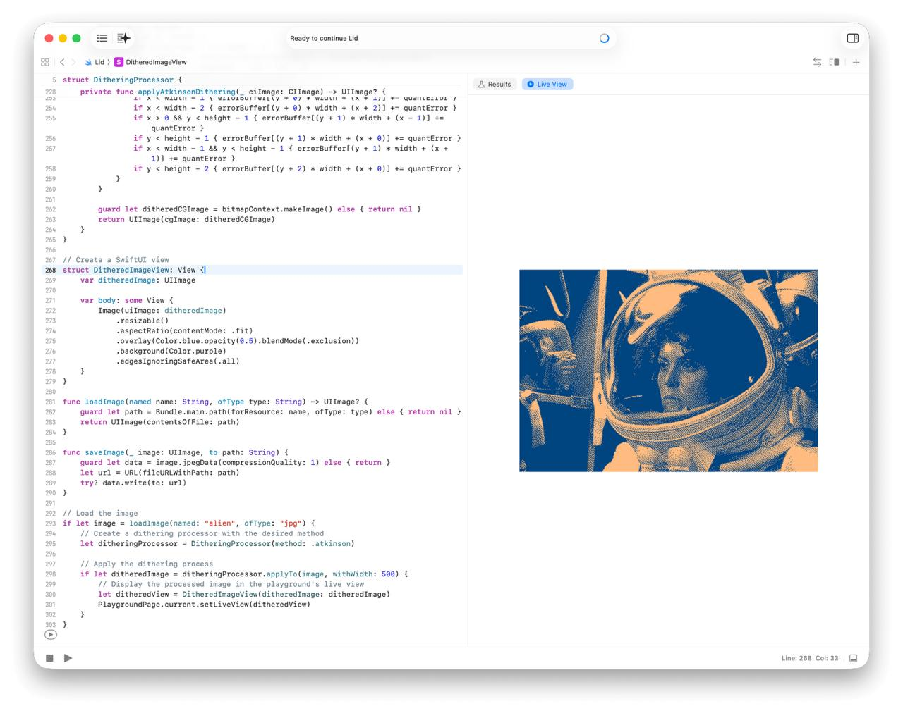

# Resources

## Lid.playground

Russell's original Xcode Swift playground from ~2023, exploring the same dithering concept that inspired this project.

- **Contents.swift** — Swift implementation of six dithering algorithms (threshold, ordered 4/9, random, error diffusion, Atkinson) using Core Image + Core Graphics. Includes a SwiftUI preview with `blendMode(.exclusion)` color overlay — the same "client-side color" concept that sloum's Lid pioneered with CSS filters.
- **alien.jpg** — Test image used in the playground (astronaut helmet portrait).
- **lid-xcode-playground.png** — Screenshot of the Lid playground in Xcode.

The Swift version predates the TypeScript port and uses a simpler approach: no gamma/linear correction, direct sRGB threshold comparison. It's a nice reference for the original aesthetic intent.
